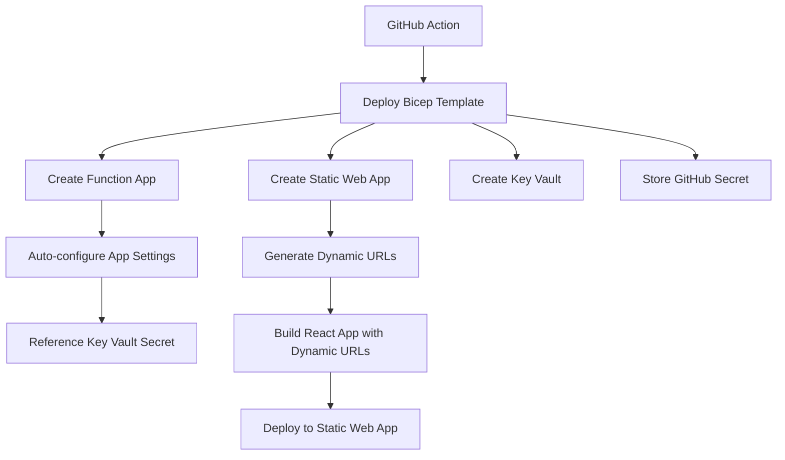

# Deployment Architecture Improvement Summary

## 🎯 **What We Changed**

### ✅ **Eliminated Imperative Steps**
**Before:**
- GitHub Action deployed infrastructure
- Then ran separate `az functionapp config appsettings set` command
- Multiple imperative steps with potential for inconsistency

**After:**
- Single `az deployment sub create` command
- All configuration defined declaratively in Bicep
- Function App settings configured automatically during deployment

### ✅ **Single Source of Truth**
**Infrastructure + Configuration = One Bicep Template**

All Function App settings now defined in `infra/main-resources.bicep`:
```bicep
siteConfig: {
  appSettings: [
    {
      name: 'GH_WEB_APP'
      value: githubClientId
    }
    {
      name: 'GH_WEB_APP_SECRET' 
      value: '@Microsoft.KeyVault(VaultName=${keyVault.name};SecretName=${githubClientSecretKv.name})'
    }
    {
      name: 'FRONTEND_URL'
      value: 'https://${staticWebApp.properties.defaultHostname}'
    }
  ]
}
```

### ✅ **Dynamic Configuration**
- **Frontend URL**: Automatically uses Static Web App hostname
- **OAuth Redirect URI**: Generated dynamically from deployed infrastructure
- **Secrets**: Stored securely in Key Vault with automatic references

### ✅ **Simplified GitHub Actions Workflow**

**Before (Multiple Steps):**
```yaml
- name: Deploy Infrastructure
- name: Update Function App Configuration  # Extra step
- name: Build Application
- name: Deploy to Static Web App
```

**After (Streamlined):**
```yaml
- name: Deploy Infrastructure              # Everything configured here
- name: Build Application  
- name: Deploy to Static Web App
```

## 🚀 **Benefits**

### **🔧 Maintainability**
- All infrastructure and configuration in one place
- No drift between imperative commands and declared state
- Version-controlled configuration

### **🛡️ Security** 
- GitHub Client Secret stored in Key Vault only
- Function App references secrets securely
- No secrets in logs or workflow output

### **⚡ Reliability**
- Atomic deployment - everything succeeds or fails together
- No partial configuration states
- Consistent deployments across environments

### **📋 Simplicity**
- Fewer workflow steps
- Less chance for errors
- Easier to understand and debug

## 🎯 **Architecture Flow**



## 📝 **Required GitHub Secrets (Simplified)**

```bash
# Only 3 secrets needed now!
AZURE_CREDENTIALS          # Service Principal for deployment
GH_WEB_APP                 # GitHub OAuth App Client ID  
GH_WEB_APP_SECRET         # GitHub OAuth App Client Secret
AZURE_STATIC_WEB_APPS_API_TOKEN # Auto-generated SWA token
```

**Removed:** `GITHUB_REDIRECT_URI` - now generated dynamically!

## ✨ **Key Improvements**

✅ **Infrastructure as Code Best Practices** - Everything declarative  
✅ **Zero Manual Configuration Steps** - Fully automated  
✅ **Dynamic URL Generation** - No hardcoded values  
✅ **Secure Secret Management** - Key Vault integration  
✅ **Atomic Deployments** - All-or-nothing approach  
✅ **Cross-Platform Scripts** - Bash + PowerShell updated  

The deployment is now truly "infrastructure as code" with no imperative configuration steps needed!
