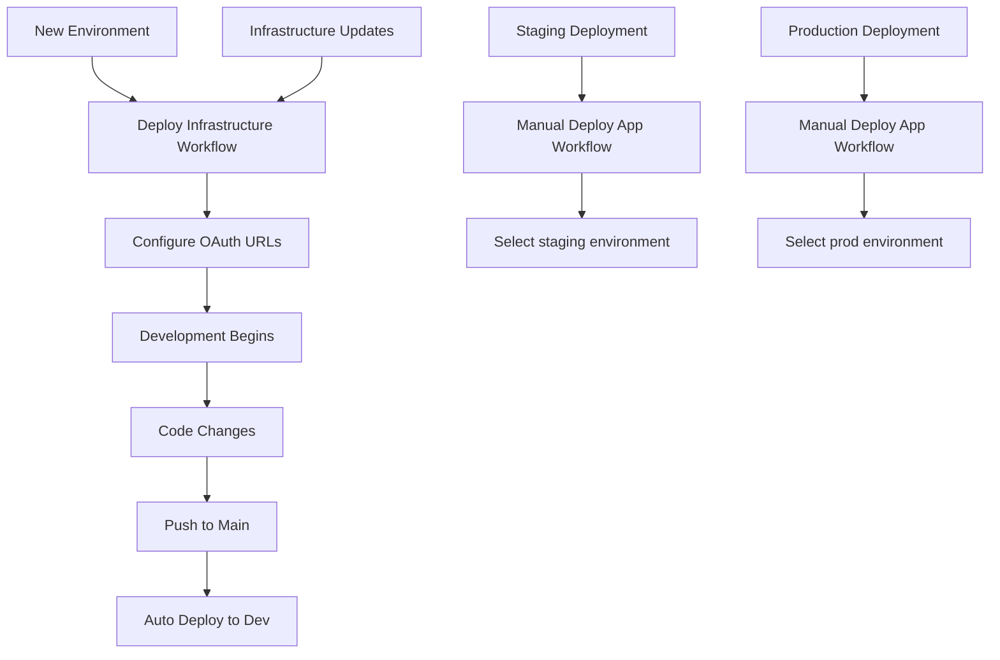

# Two-Workflow Architecture Summary

## 🎯 **What We Created**

### **1. Deploy Infrastructure Workflow** 
**File:** `.github/workflows/deploy-infrastructure.yml`

**Purpose:** One-time infrastructure setup per environment

**Features:**
- ✅ **Manual trigger only** - prevents accidental infrastructure changes
- ✅ **Environment selection** - dev, staging, prod
- ✅ **Region selection** - deploy to any Azure region
- ✅ **Complete resource creation** - SWA, Function App, Key Vault, Storage
- ✅ **Dynamic URL generation** - automatic OAuth redirect URI creation
- ✅ **Clear output instructions** - shows exact URLs for OAuth configuration

### **2. Deploy Application Workflow**
**File:** `.github/workflows/deploy-application.yml`

**Purpose:** Regular application deployments to existing infrastructure

**Features:**
- ✅ **Automatic deployment** - triggers on push to main (dev environment)
- ✅ **Manual deployment** - deploy to any environment with workflow inputs
- ✅ **Smart path filtering** - only runs when app code changes
- ✅ **Environment detection** - auto-discovers dev environment resources
- ✅ **Token-free deployment** - retrieves SWA token automatically

## 🚀 **Benefits Over Single Workflow**

### **🔧 Better Control**
- **Infrastructure changes** are intentional and controlled
- **Application deployments** are fast and frequent
- **Environment isolation** prevents cross-environment mistakes

### **⚡ Performance** 
- **Faster app deployments** - no infrastructure overhead
- **Parallel development** - multiple devs can deploy apps simultaneously
- **Resource efficiency** - only run necessary steps

### **🛡️ Safety**
- **Infrastructure protection** - manual approval required
- **Controlled deployments** - staged environment promotion
- **Reduced blast radius** - isolated failure points

### **📋 Maintainability**
- **Clear separation of concerns** - infra vs app logic
- **Easier debugging** - specific workflow for specific issues
- **Better documentation** - each workflow has single responsibility

## 🔄 **Deployment Flow**



## 📊 **Workflow Comparison**

| Aspect | Infrastructure Workflow | Application Workflow |
|--------|------------------------|---------------------|
| **Trigger** | Manual only | Auto + Manual |
| **Duration** | 5-10 minutes | 2-3 minutes |
| **Frequency** | Rare (per environment) | Frequent (per deploy) |
| **Risk** | High (creates resources) | Low (updates code) |
| **Approval** | Manual trigger required | Can be automatic |

## 🎯 **Usage Patterns**

### **🏗️ Initial Setup**
```bash
1. Run "Deploy Infrastructure" for dev environment
2. Configure GitHub OAuth App with output URLs
3. Test with "Deploy Application" workflow
4. Repeat for staging and prod environments
```

### **📦 Regular Development**
```bash
1. Make code changes
2. Push to main branch → Auto-deploys to dev
3. Test in dev environment
4. Manual deploy to staging → Use "Deploy Application"
5. Manual deploy to prod → Use "Deploy Application"
```

### **🔧 Infrastructure Changes**
```bash
1. Update Bicep templates
2. Run "Deploy Infrastructure" for target environment
3. Update OAuth App if URLs changed
4. Test application deployment
```

## ✨ **Key Improvements**

✅ **No More Chicken-and-Egg Problems** - Infrastructure creates resources, app uses them  
✅ **Environment-Specific Deployments** - Easy multi-environment management  
✅ **Automatic Token Handling** - No manual SWA token configuration  
✅ **Smart Deployment Logic** - Only deploy what changed  
✅ **Clear Separation** - Infrastructure vs application concerns  
✅ **Production Ready** - Safe deployment practices built-in  

The two-workflow approach provides enterprise-grade deployment capabilities with better control, safety, and maintainability! 🎉
